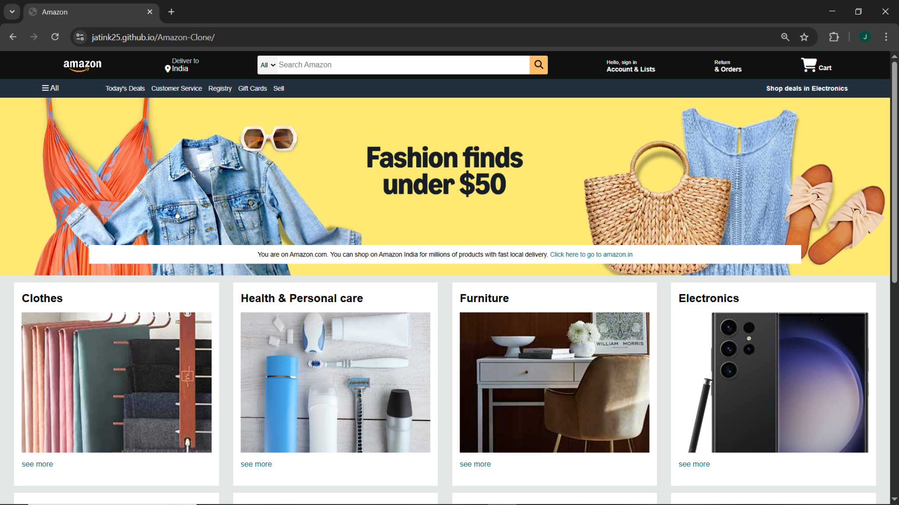

# Amazon Clone (Frontend)

This is a frontend clone of the Amazon website built using HTML and CSS.

## Features
- Home page layout
- Product sections
- Navigation bar
- Responsive design

## Tech Stack
- HTML
- CSS

## Live Demo
https://luminous-monstera-8e0d59.netlify.app/

## Screenshot

